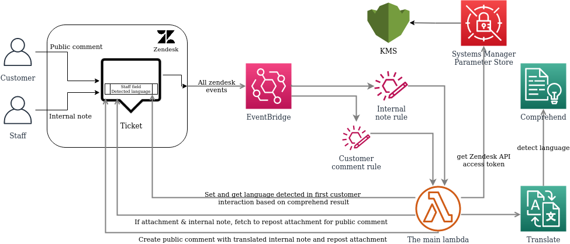

# zendesk-translation-via-aws-eventbridge-partner


 <h3 align="center">Enable the power of AWS translation for zendesk tickets</h3>
 <h3 align="center"><a href="https://medium.com/daniel-wellington-tech-stories"></a></h3>

This is a aws serverless solution to get translation for none english tickets in zendesk, both incoming and outgoing. If the language is detected wrong, the agent can easily change the language for the ticket inside of zendesk.

<br />
<br />
    
What is the difference between this project and the other ones out there including the one AWS have a released? This solution is more complete and is built on the actuall need from customer service agents (staff) as this replaced a (expensive) third party app. This was completed in april where most of other greate contributions was released around that time. After running this in ~6 months in production with a dashboard from the first day to follow the cost and time saving we decided to release it. The following features was built to be able to move from the old solution:
  * First message is detecting the language and sets a custom field in zendesk so it is easy to change the language for the agents.
  * The agent/staff reply that should be translated is posted as a internal note started with #translate <text to be translated>. The update to the customer should be the same as agent/staff and not the API user.
  * If an attachment is also part of the internal note (eg return instructions) it will be part of the public reply response.
<br />
<br />
With the solution we build, we managed to save 99.97% in running cost (OPEX), we also saved agent time (~45s per ticket update) because the translation was  automated. The old solution requierd the agents to request translation both for incoming and outgoing updates, while this solution already have the translation ready before the agents enters the case and also updates the ticket after translation is done. 
<br />
We could also ignore the OPEX cost for the this solution, you may ask your self why? The cost is now the same as the daily leasing ratefor our seven coffee machines in our HQ in Stockholm, Sweden. You may now think, what about development/initial cost (CAPEX)? The savings covered them the first 4-6 weeks and roughly took one more in man power to build where most of the time was to lear eventbridge (well invested!).

<br />
<br />

## Table of Contents

* [About the Project](#about-the-project)
  * [Built With](#built-with)
  * [Architecture](#architecture)
* [Getting Started](#getting-started)
  * [Prerequisites](#prerequisites)
  * [Deployment on AWS](#deployment-on-aws)
* [Usage](#usage)
* [Contributing](#contributing)
  * [Pull request wishlist](#pull-request-wishlist)
* [License](#license)
* [Contact](#contact)


## About The Project

### Built With

* [Zendesk](https://www.zendesk.com)
* [AWS Eventbridge](https://aws.amazon.com/eventbridge/)
* [AWS Lambda](https://aws.amazon.com/lambda/)
* [AWS Translate](https://aws.amazon.com/translate/)
* [AWS Comprehend](https://aws.amazon.com/comprehend/)
* [AWS Systems manager (Parameter Store)](https://aws.amazon.com/systems-manager/)

## Architecture
<h3 align="center"></h3>

## Getting Started


### Prerequisites
#### Technical requierments
The following needs to be on your machine to be able to deploy
* make
* git
* cat
* aws-cli
#### Soft requierments
If you don't find the settings for eventbridge on zendesk side for steps bellow, it means you don't have the "api package" (they basically bill you for not needing to setup webhooks). We got our setup deleted (we participated in the beta) from no where by zendesk when they decided to charge for that function without informing us. On the good side of that, we have built a alternative solution that is based on webhooks that put's the messages on a custom eventbridge so we don't need to pay for such subscription and we migrated to that after isch 6-7 months. The fork can be found [here](https://github.com/dwtechnologies/zendesk-translation-via-aws-eventbridge-apigateway-webhook)
### Setup zendesk as a eventbridge partner
Sadly, this is manually as the setup needs to be done on the zendesk side. You will need to start with this as you need the name of the partner eventbus, after the setup you will find it in Amazon EventBridge => Events => Partner event sources. Edit your parameters-{dev/prod}.env file and add it to EventBusName= <br />
### Setup zendesk api key
Follow the guide https://support.zendesk.com/hc/en-us/articles/226022787-Generating-a-new-API-token- and create a ssm parameter store with the key inside, make sure it is encrypted / protected with kms by using secure string. The parameter needs to be setup in the variable ZendeskKeySSMParameterPath.
https://docs.aws.amazon.com/systems-manager/latest/userguide/parameter-create-console.html
https://docs.aws.amazon.com/systems-manager/latest/userguide/param-create-cli.html
### Setup a custom field in zendesk
https://support.zendesk.com/hc/en-us/articles/203661496-Adding-custom-fields-to-your-tickets-and-support-request-form
Take a note on the ID as it will be set for ZendeskTicketLangFieldId
### Deployment on AWS

1. Clone the repo
```sh
git clone https://github.com/dwtechnologies/zendesk-translation-via-aws-eventbridge-partner.git
```
2. Edit the Make file
2.1 Make sure to set the right region (same as the eventbridge), aws profile to use and artifact bucket to upload the lambda for deployment.
3. Edit parameters file 
3.1 Set the path that you created in "Setup zendesk api key" setep. Make sure that it is kms protected (secure string) or change CF + code.
```sh
ZendeskKeySSMParameterPath=/config/zendesk-translation/zendesk_api_key
```

3.2 The rest of the parameters, the subdomain does not need to 

```sh
Environment=dev
DebugParam=true
ZendeskUsernameMail=Same-User-that-created-the-api-key@localhost
ZendeskSubdomain=zendeskSubdomain
ZendeskTicketLangFieldId=9999999999
KmsKeyId=xxx-xx-xxxx-xxx-xxx
EventBusName=aws.partner/zendesk.com/xxx/default


4. Deploy
```sh
make 
```

### Testing
I recommend to manually create a "catch all" / wildcard  eventbus rule to save the data to cloudwatch in the beginning to debug the communication going on the bus. To test the lambda, use the json files and adjust them to your needs  to test the lambda if you suspect that the lambda is not working as expected.


## Contributing

Any contributions you make are **greatly appreciated** but please have in mind to make what you create must be dynamic to not break current use case

1. Fork the Project
2. Create your Feature Branch (`git checkout -b feature/AmazingFeature`)
3. Commit your Changes (`git commit -m 'Add some AmazingFeature'`)
4. Push to the Branch (`git push origin feature/AmazingFeature`)
5. Open a Pull Request


### Pull request wishlist
* Convert to sam cli build that makes more sense for the public

## License

Distributed under the GPL-3.0 License. See `LICENSE` for more information.


## Contact

Lezgin Bakircioglu - <a href="https://twitter.com/lerra82"></a> 
<a href="https://medium.com/@lerra82"></a> 
